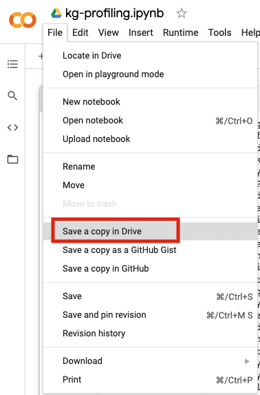
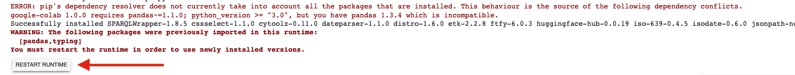

# Welcome to the KGTK notebook tutorial

The goal of this tutorial repository is to introduce the functionality of KGTK to first-time users. The [Knowledge Graph Toolkit (KGTK)](https://kgtk.readthedocs.io/en/latest/) is a comprehensive framework for the creation and exploitation of large hyper-relational knowledge graphs (KGs), designed for ease of use, scalability, and speed. The tutorial consists of several notebooks that demonstrate how to perform network analysis, graph profiling, knowledge enrichment, and embedding computation over a portion of the Wikidata knowledge graph. The tutorial notebooks can be found in the `tutorial` [folder](https://github.com/usc-isi-i2/kgtk-notebooks/tree/main/tutorial). All notebooks require minimum configuration and can be run locally or in Google Colab in a matter of a few minutes. The input data for the notebooks is stored in the `datasets` [folder](https://github.com/usc-isi-i2/kgtk-notebooks/tree/main/datasets). Basic understanding of knowledge graphs is sufficient for this tutorial. 

This repository has been created for the purpose of the KGTK tutorial presented at ISWC 2021. For more information on this tutorial, see our [website](https://usc-isi-i2.github.io/kgtk-tutorial-iswc-2021/).

## Notebooks

1. `kg-profiling.ipynb` performs profiling of a Wikidata subgraph, by computing deep statistics of its classes, instances, and properties.
2. `kg-graph-embeddings.ipynb` computes graph embeddings of a Wikidata subgraph using kgtk, demonstrates how to use these embeddings for similarity estimation, and visualizes them.
3. `kg-augment.ipynb` shows how structured data from IMDb can be integrated into a subset of Wikidata.
4. `enriching-wikidata-with-getty.ipynb` shows how LOD graphs like Getty Vocabulary can be used to enrich Wikidata by using kgtk operations.
5. `kg-network-analysis.ipynb` analyzes the family network of Arnold Schwarzenegger (Q2685) in Wikidata by using KGTK operations.

## Running the notebooks in Google Colab

List of steps required to be able to run the ISI Google colab Notebooks.

### Make a copy of the to your Google Drive.

The following tutorial notebooks are available to run in Google Colab

1. [kg-profiling.ipynb](https://colab.research.google.com/drive/15JnQA_Uk17Q7u3CADmjwrv7Nkaf2_d9j?usp=sharing)
2. [kg-graph-embeddings.ipynb]()
3. [kg-augment.ipynb]()
4. [enriching-wikidata-with-getty.ipynb](https://colab.research.google.com/drive/1kYzTs-nO6C49T6S4Hqn6pveB49S7ehUy?usp=sharing)
5. [kg-network-analysis.ipynb](https://colab.research.google.com/drive/1qgg1FBCtlJe339iFfzqPHNgIlerX3VOH?usp=sharing)

Click on a link, it'll take you to the Google Colab notebook. This is a readonly notebook. 

Click on `Save a copy in Drive` from the `File` menu as shown.

This will create a copy of the notebook in your Google Drive.

### Install `kgtk`

Run the first cell to install [kgtk](https://github.com/usc-isi-i2/kgtk).

You'll see an error after the install finishes,

This is because of a conflict in Google Colab's python environment. You **have** to click on
the `Restart Runtime` button. 

You do not have to install `kgtk` again. 

In some notebooks, there are a few more installation cells, in case you see the same error as above, 
please click on `Restart Runtime`

### Run  the cells in the notebook

Now, simply run all the cells. The notebook should run successfully.

### Google Colab Caveats

- The colab VM and python environment is ephemeral. The VM will reset after a while, all the installed libraries and files produced will be lost. 
- You can [connect a google drive](https://www.marktechpost.com/2019/06/07/how-to-connect-google-colab-with-google-drive/) to the colab notebook to read from and save to.
- Users can run the same colab notebook by sharing it with a link. This can have unwanted complications in case multiple people run the same cell at the same time.

## Contact
* Amandeep Singh (`amandeep@isi.edu`)
* Pedro Szekely (`pszekely@isi.edu`)
* Filip Ilievski (`ilievski@isi.edu`)
